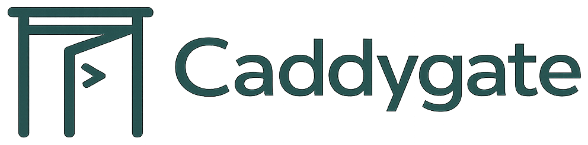
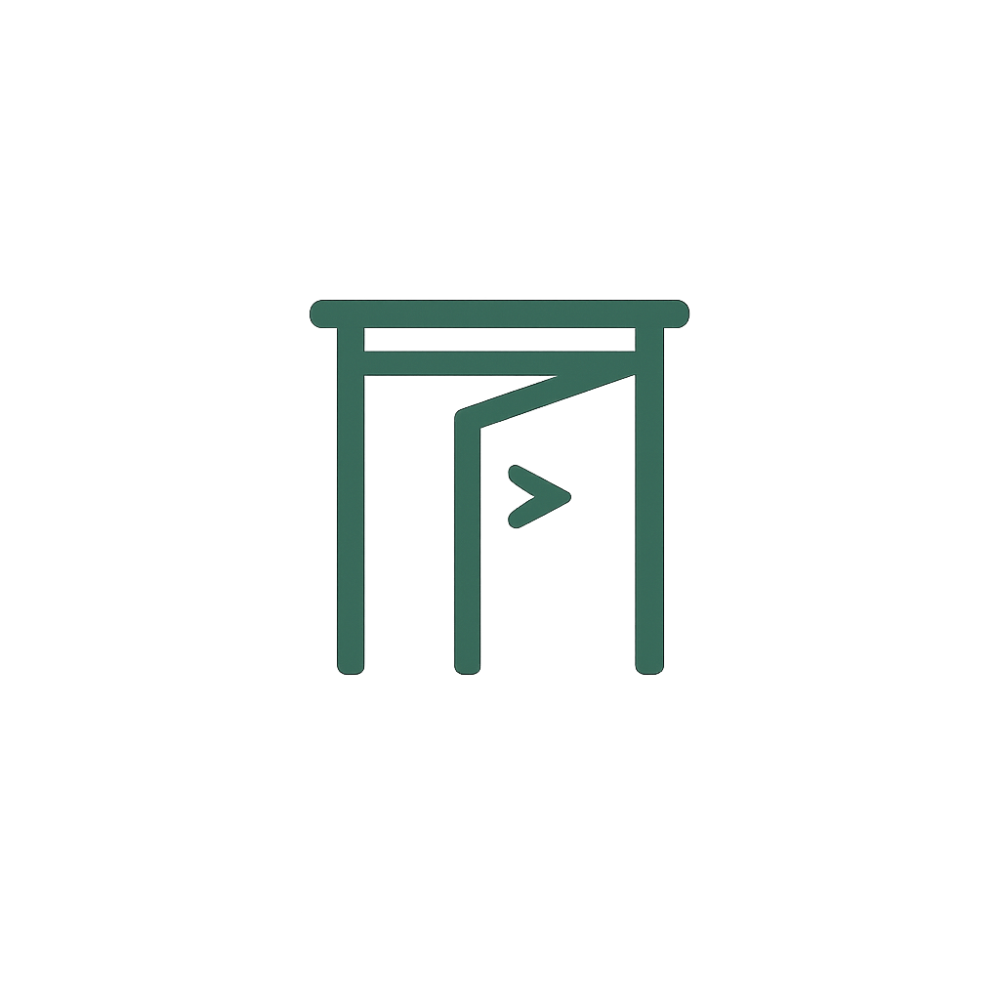

<!-- _class: cover -->
<!-- _paginate: false -->

<!-- カバー hero 背景プレースホルダー（#ECF3EE グラデ面）-->
<!-- 画像生成後: image-prompts.md の cover-hero 参照、src を assets/cover-hero.jpg に差し替え -->

# キャディが、開く。

九州のゴルフ場の朝を、 断らない経営へ。

ゴルフ場オーナー・支配人さま向けご提案資料

Caddygate（キャディゲート）&nbsp;&nbsp;|&nbsp;&nbsp;2026年6月&nbsp;&nbsp;|&nbsp;&nbsp;九州先発・福岡／長崎から。

---

<!-- _class: content -->

## 土曜の朝に断っていた1組が、 1件 ¥2,500 で埋まります。

ハイシーズンの土日、キャディが足りずに組数を絞った日。あの1組のキャディ枠を、九州の登録キャディで埋めます。

ご利用は、予約が成立した時だけ。**1件 ¥2,500 の予約手数料のみ。**
初期費用も、月額費用も、ありません。

ご契約後、最初の3ヶ月は手数料も無料。九州 70 コース限定の先行枠でご案内します。

<small>[36][39][40]</small>

---

<!-- _class: chapter -->
<!-- _paginate: true -->

01

# 業界の現実

客は戻った。利益は、戻っていない。

---

<!-- _class: data -->

## 8,100 億円の市場は回復した。 1コースあたりの利益は、戻っていない。

  

    8,100億円
    市場規模（前年比 +3.0%）
  

  

    −1.76%
    1コースあたり利用者（前年比）
  

  

    15年
    客単価1万円割れの継続期間
  

2024年度、ゴルフ場市場は4年連続の増収、6年ぶりに8,100億円台へ回復しました。
一方、1ゴルフ場あたりの利用者は前年比 −1.76%、客単価は15年以上1万円を割ったまま。
2026年3月には、会員制名門コースが負債120億円で倒産しました。

**「客は来るのに、利益が出ない。」これが、業界全体の共通言語です。**

<small>[1][2][4][8][9][16]</small>

---

<!-- _class: data -->

## 正社員キャディ 84.4% 不足、 パートキャディ 90.5% 不足。

  

    84.4%
    正社員キャディ不足の回答率
  

  

    90.5%
    パートキャディ不足の回答率
  

  

    292.8万円
    関東ゴルフ会員権 平均（15年ぶり高値）
  

採用広告を出しても20代は集まらず、育成には3〜6か月かかる。
その一方、法人接待は確実に戻っています。

**「キャディ付きで取れません」とお断りする日が、増えていませんか。**

<small>[3][10][14][24][27]</small>

---

<!-- _class: content -->

## 1組を断る、ということ。

キャディ付き1組の売上は、プレーフィー、食事、物販を合わせて **2〜3万円** が業界相場です。

- 週に5組をお断りすると、シーズン5か月で **150〜300万円** の機会損失
- ハウスキャディ正社員1名の人件費は年 **350〜500万円**。繁忙日以外も固定費は止まらない
- ポータルサイトへ流れる送客手数料も、年来場4万人なら **2,000〜4,000万円**

組数を絞った日に、いちばん多くを失っています。

<small>[5][11][22][25][26][27][31]</small>

---

<!-- _class: chapter -->
<!-- _paginate: true -->

02

# Caddygate とは

予約が決まった時だけ、ご利用いただけます。

---

<!-- _class: content -->

## 予約が決まった時だけ、ご利用いただけます。

九州のゴルフ場の求人情報を、登録済みのキャディに届けます。
応募と承諾で予約が成立すると、**1件 ¥2,500 の予約手数料**が発生します。

初期費用も、月額費用も、契約期間の縛りも、ありません。

  

    ①
    募集日と 必要人数を入力
  

  

    ②
    九州の登録キャディ から応募
  

  

    ③
    プロフィールを見て 予約確定
  

  

    ④
    月末に まとめて精算
  

**成果報酬・変動費化・初期費用ゼロ。ご利用時のみ、1件 ¥2,500。**

---

<!-- _class: content -->

## 九州の、続けてくれる人たちが、登録しています。

中核は、**福岡大学・長崎国際大学のゴルフ部の現役学生。**
ハンディキャップを持つ経験者、キャディ経験のあるシニア層も加わります。

登録前に、オンライン教材、半日の現地研修、先輩キャディとの同行ラウンドを2〜4週間。独り立ちまでの設計が揃っています。評価は累計ラウンド数・ラウンド後の評価平均など、客観指標のみで自動算出します。

**※ 以下は登録キャディの想定プロフィール例（実在の方ではありません）**

| 氏名（想定例） | 区分 | 経験 | 主な対応エリア |
|---|---|---|---|
| 田中 翔太 | 福岡大学ゴルフ部 3年 | HC6・大学公式戦出場 | 福岡・佐賀 |
| 山口 美咲 | 長崎国際大学ゴルフ部 強化指定 | HC8・地区アマ準V | 長崎・佐世保 |
| 川口 健 | 元ハウスキャディ 12年 | 名門コース在籍経験 | 北九州・大分 |

単発の人手ではなく、貴クラブの常連にも顔を覚えてもらえる関係に。

<small>[27]</small>

---

<!-- _class: screenshot -->

## 朝、PC を開けば、その日のキャディが確定しています。

募集中の予約、応募者のプロフィール、当日のアサイン、月次の精算。すべて1画面で見渡せます。
電話を何本もかける朝は、ここで終わります。

  

    

    
caddygate.jp/dashboard

  

  

    <!-- スクショ撮影後: assets/screenshots/dashboard-pc.png を src に指定して差し替え -->
    <!--  -->
    画面イメージ — 撮影後に差し替え <small>左: 本日予約一覧 / 中央: 応募者カード / 右: 月次精算サマリ</small>
  

「キャディマスター室の電話を、支配人室から1画面で。」

---

<!-- _class: screenshot -->

## 貴クラブの顔を、キャディ側にも伝えます。

コースのギャラリー、所在地、ハウス施設、HPリンク、キャディへのメッセージ。
応募する側に貴クラブを選ぶ理由を渡すと、リピートで入ってくれる確率が上がります。

  

    

    
caddygate.jp/club/profile

  

  

    <!-- スクショ撮影後: assets/screenshots/club-profile-pc.png を差し替え -->
    <!--  -->
    画面イメージ — 撮影後に差し替え <small>ヒーロー画像 / コース概要 / ギャラリー / 支配人メッセージ</small>
  

求人広告では伝わらない「貴クラブらしさ」を、プロフィールで届けます。

---

<!-- _class: screenshot -->

## 出張先からでも、ゴルフ場を1分で動かせます。

スマートフォンからの操作も、PC と同じ画面のまま。応募の通知を受け取って、その場で承諾。精算書のダウンロードも、画面の中で完結します。

  

    

    
caddygate.jp （モバイル）

  

  

    <!-- スクショ撮影後: assets/screenshots/mobile-app.png を差し替え -->
    <!--  -->
    画面イメージ — 撮影後に差し替え <small>ホーム / 通知 / 応募者確定 / 過去6か月明細</small>
  

支配人室にいない朝も、ご対応いただけます。

---

<!-- _class: compare -->

## 朝のオペレーションが、こう変わります。

  

    Before — これまで
    <ul>
      <li>前夜の発熱連絡で、5組分を断っていた</li>
      <li>心当たりの業者に電話、また電話</li>
      <li>急ぎ手配は、コースを知らないキャディが来てしまう</li>
      <li>月末は複数業者からの請求書を経理が突合</li>
      <li>採用広告に出しても、20代の応募はゼロ</li>
      <li>「キャディ付き堅持」を諦めかけていた</li>
    </ul>
  

  

    After — Caddygate 導入後
    <ul>
      <li>募集を出して、応募が届き、当日朝にアサイン完了</li>
      <li>1画面で応募と承諾、電話0本の朝</li>
      <li>同じキャディが繰り返し入り、常連と顔見知りに</li>
      <li>月末に1通の請求書、勘定科目もシンプル</li>
      <li>九州の大学生キャディが、貴クラブの求人を見て応募</li>
      <li>断らない朝のために、もうひとつの門が開く</li>
    </ul>
  

固定費は増やさず、朝から断らずに済む経営へ。

---

<!-- _class: chapter -->
<!-- _paginate: true -->

03

# 料金・導入の流れ

予約が成立した時だけ、1件 ¥2,500。

---

<!-- _class: pricing -->

## 予約が成立した時だけ、1件 ¥2,500。

予約手数料は、1件 **¥2,500**。これ以外の料金は、ございません。
登録は無料、月額は無料、解約はいつでも無料。最低契約期間は、ありません。

| 項目 | 金額 |
|---|---|
| 初期費用 | ¥0 |
| 月額固定費 | ¥0 |
| 求人掲載料 | ¥0 |
| 予約手数料（成立時のみ） | **¥2,500 / 件** |
| 解約料 | ¥0 |
| 最低契約期間 | なし |

九州 70 コース限定 先行特典

ご契約後の最初の3ヶ月、予約手数料 ¥2,500 → **¥0**。固定費ではなく、変動費。動いた時だけ、ご請求します。

---

<!-- _class: content -->

## 4ステップで、来週から始められます。

ご契約から運用開始まで、おおむね5営業日。オペレーションのご説明は、オンラインまたはご訪問で。

| ステップ | 内容 | 所要 |
|---|---|---|
| ① 無料登録 | 運営会社情報、銀行口座、利用規約への同意 | 1営業日 |
| ② 募集日入力 | 必要な日付・時間・人数・コース情報を入力 | 5分 / 件 |
| ③ キャディ選定 | 応募者のプロフィールを見て、選んで確定 | 同日中 |
| ④ 通知で完了 | キャディ・貴クラブ双方に確定通知、当日のラウンドへ | 自動 |

ご契約前に、契約書ドラフト、利用規約、特定商取引法に基づく表記をすべてお渡しします。ご稟議の添付資料としてお使いください。

**最短、来週の土曜から間に合います。**

---

<!-- _class: content -->

## 九州先発、70コース限定。

サービス開始の最初の3ヶ月、予約手数料を無料でお試しいただけます。

ご契約の順に、福岡56コース、長崎の名門を含む70コース超を対象にご案内中です。

九州で先に動いたコースが、九州の登録キャディと先に関係を結べます。人手を、これからの10年で奪い合う前に。

- 予約手数料：契約後3ヶ月 **¥0**（通常 ¥2,500 / 件）
- 登録料・月額：永久に **¥0**
- 専任の立ち上げ担当が、初回募集の入力まで伴走
- 解約はいつでも無料、お試し期間内なら手数料も発生いたしません

**九州の門は、九州で開く。**

<small>[36][39][40]</small>

---

<!-- _class: cta -->
<!-- _paginate: false -->

# ご検討、ありがとうございます。

資料請求・オンラインデモ・ご訪問のご相談、いずれもお手すきの折にご連絡ください。 ご返信は2営業日以内に差し上げます。

  

    
山田 拓実（Caddygate）

    

      株式会社 FAIA 
      info@caddygate.jp 
      TEL: 092-XXX-XXXX（代表 / 仮） 
      https://caddygate.jp
    

  

土曜の朝が、変わります。ご一緒できれば幸いです。

---

<!-- _class: content -->
<!-- _paginate: false -->

## 出典

| 番号 | 出典 |
|---|---|
| [1][2] | 帝国データバンク「ゴルフ場業界 動向調査 2024年度」/ プレスリリース（2025/12） |
| [3] | e!Golf「キャディ不足率 84.4% / 90.5%」 |
| [4] | 帝国データバンク 倒産集計 2026年3月報（三河CC 負債120億円） |
| [5] | PR TIMES「東急ゴルフリゾート Caddy Fit 稼働開始」 |
| [8][9] | NGK 日本ゴルフ場経営者協会「2024年度ゴルフ場利用者数」/ GEW「ゴルフ場経営は構造的に儲からない」 |
| [10] | ゴルフライフデザイン GLD「キャディ不足は解消するのか」 |
| [11][22][31] | たぬきゴルフ「ハウスキャディ給与」/ 日経ビジネス「2025年問題」/ 求人ボックス「キャディ平均年収 461万円」 |
| [14][24] | 日経「ゴルフ会員権 15年ぶり高値 平均292.8万円」 |
| [16] | 反趙ゴルフ会員権市場「全国ゴルフ場総数 2,154」（2025年2月末） |
| [25][26] | エースガーデン「キャディ付きメリット」/ ゴルフドゥ「プレー料金」 |
| [27] | 信和ゴルフグループ・太平洋クラブ 若手育成プロジェクト（研修3-6か月） |
| [36][39][40] | マイキャディ公式 / 楽天GORA 福岡県56コース / 楽天GORA 長崎県・NGK雲仙ゴルフ場 |
